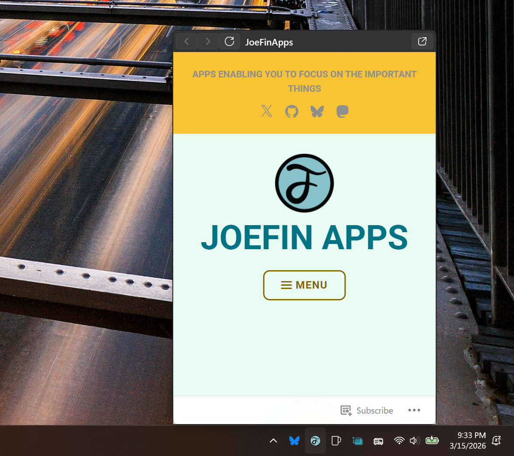
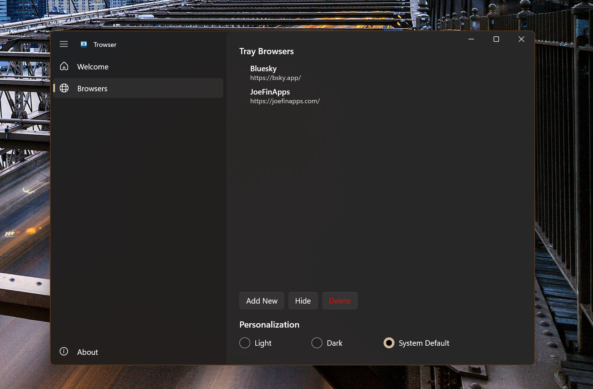

<p align="center">
  
</p>
<h1 align="center">
  Trowser
</h1>
<p align="center">
  A browser that lives in the tray.
</p>

<p align="center">
  
  &nbsp;
  
</p>

## What is Trowser?

Trowser is a WinUI 3 Windows desktop application that lets you pin browser shortcuts as tray icons. Click a tray icon to open a flyout WebView2 panel right from the taskbar, or pop it out into a standalone window.

- Add multiple browser shortcuts, each with its own tray icon
- Flyout panel opens instantly from the system tray
- Pop-out button opens a full `BrowserWindow`
- Configurable flyout size per browser
- Mobile emulation enabled by default
- Favicon auto-fetched and cached per config

## Requirements

- Windows 10 Build 19041 (20H1) or later
- [.NET SDK 9.0.311](https://dotnet.microsoft.com/download) (pinned via `global.json`)
- [Windows App SDK](https://learn.microsoft.com/en-us/windows/apps/windows-app-sdk/downloads)
- x64 or ARM64 architecture

## Build & Run

```bash
# Build (Debug, x64)
dotnet build

# Build (Release)
dotnet build -c Release

# Run directly
dotnet run --project Trowser/Trowser.csproj

# Publish MSIX
dotnet publish -c Release -p:Platform=x64
```

## Architecture

**Pattern:** MVVM + `Microsoft.Extensions.Hosting` DI container

| Project | Purpose |
|---|---|
| `Trowser.Core` | Models (`TrayBrowserConfig`), `FileService` for JSON persistence, shared helpers |
| `Trowser` | WinUI 3 app — Views, ViewModels, Services |

**Key files:**
- `App.xaml.cs` — single-instance enforcement, DI init, tray icon lifecycle
- `TrayBrowserService` — loads configs from `%LocalAppData%/Trowser/ApplicationData/TrayBrowsers.json`
- `FaviconService` — fetches/caches icons to `%LocalAppData%/Trowser/Icons/{configId}.ico`
- `SettingsWindow` → `SettingsPage` → `SettingsViewModel` — full CRUD for browser configs

**Shared WebView2 environment** cached at `%LocalAppData%/Trowser/WebView2Data`, shared across all `BrowserPage` instances.

## Settings & Data

| Item | Path |
|---|---|
| Browser configs | `%LocalAppData%/Trowser/ApplicationData/TrayBrowsers.json` |
| App settings | `%LocalAppData%/Trowser/ApplicationData/LocalSettings.json` |
| Cached favicons | `%LocalAppData%/Trowser/Icons/` |
| Debug log | `%LocalAppData%/Trowser/trowser-debug.log` |
